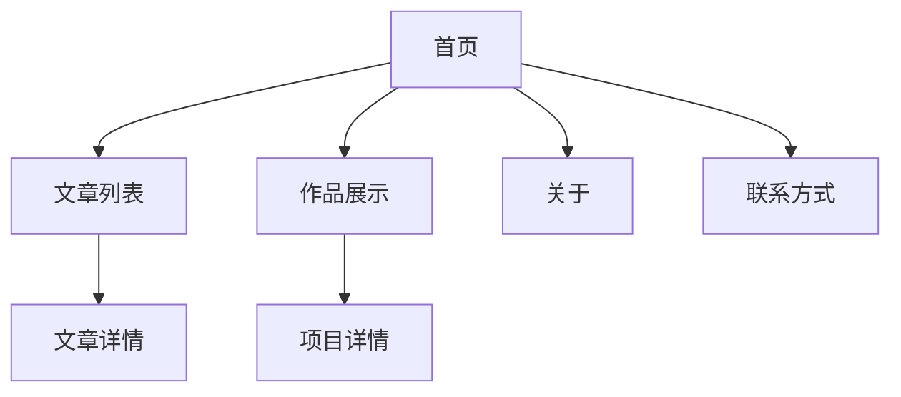

## 1. Product Overview

个人品牌展示网站，主题为"Writer & Builder · 产品经理 · AI 探索者"，旨在展示个人专业身份、写作成果和技术作品。通过现代简约的设计风格，向访客传达在产品管理、AI探索和写作创作三个核心方向的专业能力和思考。

目标用户包括：潜在合作伙伴、招聘方、技术社区同行、内容读者等，通过网站建立个人专业形象并促进交流合作。

## 2. Core Features

### 2.1 User Roles

本网站为个人展示型网站，无需用户注册登录功能，所有内容对访客开放浏览。

### 2.2 Feature Module

网站包含以下核心页面：

1. **首页**：Banner展示、个人简介、最新文章、精选作品
2. **文章页面**：文章列表、分类标签、文章详情、评论功能
3. **作品页面**：项目卡片展示、项目详情
4. **关于页面**：详细介绍个人信息
5. **联系方式页面**：联系信息和社交链接

### 2.3 Page Details

| Page Name | Module Name | Feature description                                  |
| --------- | ----------- | ---------------------------------------------------- |
| 首页        | Banner区域    | 展示主题标语"Writer & Builder · 产品经理 · AI 探索者"，使用动态背景或插画元素 |
| 首页        | 个人简介        | 200字职业身份说明，突出写作、构建、AI探索三大方向，支持富文本展示                  |
| 首页        | 最新文章        | 展示3-5篇最新文章，包含缩略图、标题、摘要、发布时间、阅读量                      |
| 首页        | 精选作品        | 3个重点项目卡片式布局，展示项目名称、简介、技术标签、状态                        |
| 文章列表页     | 文章列表        | 分页展示所有文章，支持按分类筛选（产品思考/AI实践/效率工具）                     |
| 文章列表页     | 搜索功能        | 支持按标题、关键词搜索文章                                        |
| 文章详情页     | 文章正文        | 支持Markdown格式渲染，包含标题、发布时间、阅读量、标签                      |
| 文章详情页     | 评论区         | 支持访客留言评论，展示评论列表                                      |
| 作品展示页     | 项目卡片        | 网格布局展示所有项目，每个卡片包含名称、logo、简介、技术标签、状态                  |
| 作品详情页     | 项目详情        | 展示项目详细介绍、技术栈、项目截图、演示链接等                              |
| 关于页面      | 个人信息        | 详细介绍个人背景、技能、经历等完整信息                                  |
| 联系方式页     | 联系信息        | 展示邮箱、社交媒体链接、联系表单等                                    |

## 3. Core Process

访客访问网站的主要流程：

1. 访客通过任何页面进入网站
2. 浏览首页了解个人品牌和最新内容
3. 通过顶部导航访问文章或作品页面深入了解
4. 阅读文章详情或查看项目详情
5. 通过关于和联系方式页面获取更多信息并建立联系

## 4. User Interface Design

### 4.1 Design Style

* **主色调**：专业蓝 (#2563eb) + 活力橙 (#f97316)

* **辅助色**：深灰 (#1f2937)、浅灰 (#f3f4f6)、纯白 (#ffffff)

* **字体组合**：Inter（标题/导航）+ Source Serif（正文内容）

* **按钮风格**：圆角设计，悬停状态有颜色变化动画

* **布局风格**：卡片式布局为主，顶部固定导航栏

* **图标风格**：使用简约线性图标，适当配合AI相关插画元素

### 4.2 Page Design Overview

| Page Name | Module Name | UI Elements                                       |
| --------- | ----------- | ------------------------------------------------- |
| 首页        | Banner区域    | 全宽背景，渐变色或AI插画，主题标语居中，字体大小48px，加粗                  |
| 首页        | 个人简介        | 白色卡片背景，最大宽度800px，行高1.6，字号16px，适当留白                |
| 首页        | 最新文章        | 网格布局，每篇文章卡片包含图片(16:9)、标题(20px)、摘要(14px)、元信息(12px) |
| 首页        | 精选作品        | 三列网格，卡片包含项目图标、标题(18px)、简介(14px)、技术标签、状态标识         |
| 文章列表页     | 文章卡片        | 列表布局，每篇文章显示缩略图、标题、摘要、标签、发布时间、阅读量                  |
| 文章详情页     | 文章正文        | 最大宽度800px，标题32px，正文16px，行高1.8，代码块语法高亮             |
| 作品展示页     | 项目网格        | 响应式网格，根据屏幕大小自动调整列数，卡片悬停有阴影效果                      |

### 4.3 Responsiveness

* **设计理念**：桌面端优先，自适应移动端

* **断点设置**：768px（平板）、1024px（桌面）

* **移动端适配**：导航栏转为汉堡菜单，内容区域左右边距24px

* **触摸优化**：按钮和链接区域最小44px，支持触摸滑动操作

### 4.4 附加功能

* **暗黑模式**：支持手动切换，自动跟随系统设置

* **加载动画**：页面切换和数据加载时显示简约加载指示器

* **微交互**：按钮悬停、卡片悬停、链接点击等状态变化

* **SEO优化**：支持meta标签、结构化数据、Open Graph协议

