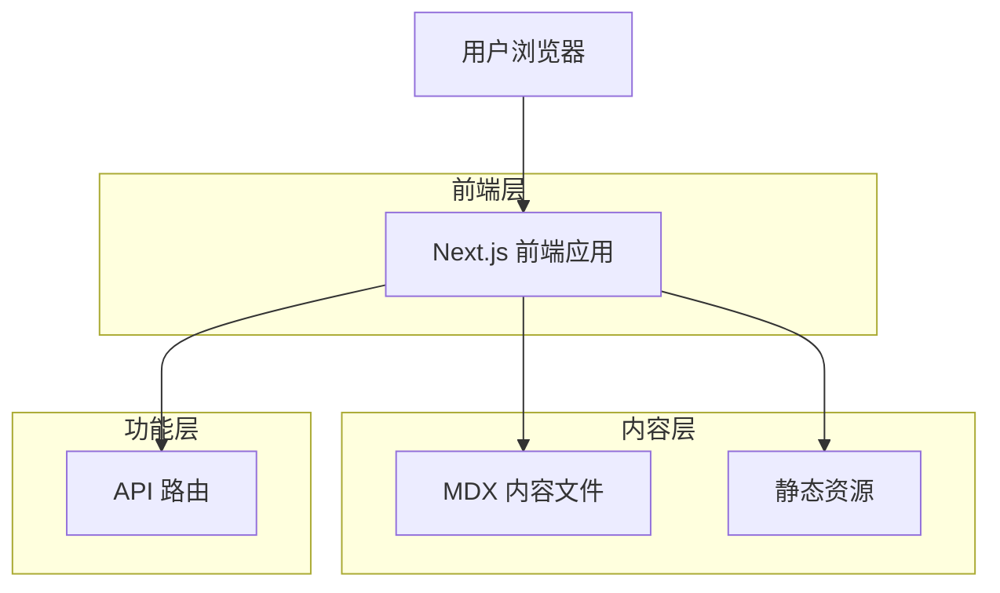

# 技术架构文档

## 1. 架构设计



## 2. 技术描述

- **前端框架**: Next.js@14 + TypeScript@5
- **样式方案**: Tailwind CSS@3 + PostCSS
- **内容管理**: MDX + gray-matter
- **图标库**: lucide-react
- **代码高亮**: prism-react-renderer
- **初始化工具**: create-next-app

## 3. 目录结构

```
src/
├── app/                    # Next.js App Router
│   ├── page.tsx           # 首页
│   ├── articles/          # 文章相关页面
│   │   ├── page.tsx       # 文章列表页
│   │   ├── [slug]/        # 文章详情页
│   │   │   └── page.tsx
│   ├── projects/          # 作品展示页面
│   │   ├── page.tsx       # 作品列表页
│   │   ├── [slug]/        # 作品详情页
│   │   │   └── page.tsx
│   ├── about/             # 关于页面
│   │   └── page.tsx
│   ├── contact/           # 联系方式页面
│   │   └── page.tsx
│   ├── api/               # API路由
│   │   └── comments/      # 评论相关API
│   └── layout.tsx         # 全局布局
├── components/             # 可复用组件
│   ├── ui/                # 基础UI组件
│   │   ├── Button.tsx
│   │   ├── Card.tsx
│   │   ├── Navigation.tsx
│   │   └── Footer.tsx
│   ├── sections/          # 页面区块组件
│   │   ├── Hero.tsx       # Banner区域
│   │   ├── ArticleList.tsx
│   │   ├── ProjectGrid.tsx
│   │   └── ContactForm.tsx
│   └── layouts/           # 布局组件
├── lib/                   # 工具函数
│   ├── mdx.ts            # MDX处理工具
│   ├── utils.ts          # 通用工具函数
│   └── types.ts          # TypeScript类型定义
├── styles/               # 样式文件
│   └── globals.css       # 全局样式
└── content/              # 内容文件
    ├── articles/         # 文章MDX文件
    │   ├── product-thinking/
    │   ├── ai-practice/
    │   └── efficiency-tools/
    └── projects/         # 作品MDX文件
```

## 4. 路由定义

| 路由 | 用途 |
|------|------|
| `/` | 首页，展示个人品牌和精选内容 |
| `/articles` | 文章列表页，支持分类筛选 |
| `/articles/[slug]` | 文章详情页，渲染MDX内容 |
| `/projects` | 作品展示页，网格布局 |
| `/projects/[slug]` | 作品详情页，展示项目信息 |
| `/about` | 关于页面，详细介绍个人信息 |
| `/contact` | 联系方式页面，包含联系表单 |

## 5. 核心组件设计

### 5.1 布局组件
- **Navigation**: 顶部导航栏，支持响应式菜单
- **Footer**: 页脚组件，包含版权和社交链接
- **Layout**: 全局布局包装器

### 5.2 UI组件
- **Button**: 圆角按钮，支持多种变体和状态
- **Card**: 卡片容器，用于文章和项目展示
- **Tag**: 标签组件，用于技术栈和分类

### 5.3 内容组件
- **ArticleCard**: 文章卡片，显示缩略图和元信息
- **ProjectCard**: 项目卡片，展示项目基本信息
- **MDXRenderer**: MDX内容渲染器，支持代码高亮

## 6. 数据管理策略

### 6.1 内容组织
- **文章分类**: product-thinking, ai-practice, efficiency-tools
- **项目状态**: active, completed, archived
- **元数据**: 使用gray-matter在MDX文件中定义

### 6.2 内容结构示例
```mdx
---
title: "文章标题"
date: "2024-01-15"
category: "product-thinking"
tags: ["产品设计", "用户体验"]
readingTime: 5
image: "/images/article-cover.jpg"
---

文章内容...
```

### 6.3 内容获取函数
```typescript
// lib/mdx.ts
export async function getArticles(category?: string) {
  // 读取content/articles目录
  // 解析MDX文件的frontmatter
  // 返回排序后的文章列表
}

export async function getArticleBySlug(slug: string) {
  // 根据slug获取特定文章
  // 解析MDX内容为React组件
}
```

## 7. 性能优化

### 7.1 静态生成
- 使用Next.js的静态生成功能
- 文章和项目详情页在构建时预渲染
- 支持ISR（增量静态再生）

### 7.2 图片优化
- 使用Next.js Image组件
- 支持WebP格式和响应式图片
- 图片懒加载

### 7.3 代码分割
- 按页面和组件进行代码分割
- 动态导入大型组件
- 优化打包体积

## 8. SEO配置

### 8.1 元数据管理
- 使用Next.js的Metadata API
- 支持Open Graph和Twitter Card
- 结构化数据标记

### 8.2 Sitemap生成
- 自动生成sitemap.xml
- 包含所有文章和项目页面
- 支持多语言版本

## 9. 部署配置

### 9.1 构建配置
```json
{
  "scripts": {
    "dev": "next dev",
    "build": "next build",
    "start": "next start",
    "export": "next build && next export"
  }
}
```

### 9.2 环境变量
```env
NEXT_PUBLIC_SITE_URL=https://your-domain.com
NEXT_PUBLIC_SITE_NAME="Writer & Builder"
NEXT_PUBLIC_SITE_DESCRIPTION="产品经理 · AI 探索者"
```

## 10. 开发规范

### 10.1 代码规范
- 使用TypeScript严格模式
- ESLint + Prettier代码格式化
- 组件使用PascalCase命名
- 工具函数使用camelCase命名

### 10.2 提交规范
- 使用Conventional Commits
- 类型包括: feat, fix, docs, style, refactor
- 提交信息使用中文或英文

### 10.3 文件命名
- 组件文件: ComponentName.tsx
- 页面文件: page.tsx
- 工具文件: util-name.ts
- 内容文件: article-name.mdx